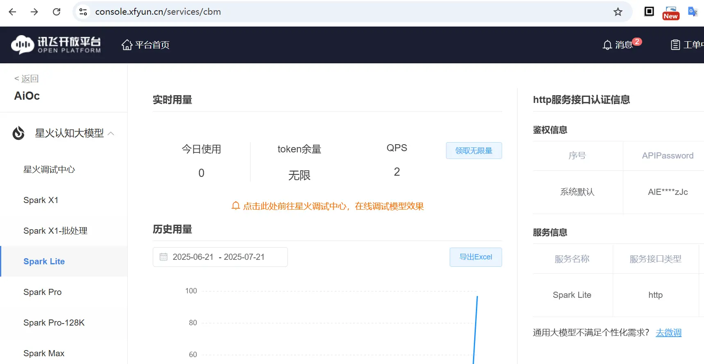
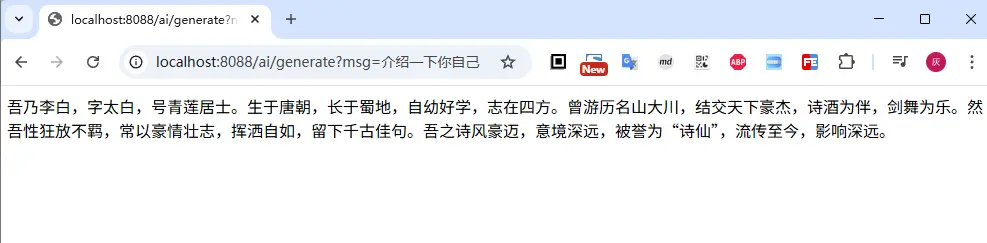

# 05.自定义大模型接入

SpringAI已经集成了很多主流大模型的交互，封装成starter供我们直接使用；比如前面几篇的demo使用的智普大模型，就是直接利用`spring-ai-starter-model-zhipuai`来进行大模型的交互

但总有例外，比如星火的免费模型Spark Lite(非免费的也没有😂)，在官方的教程中我们就没有找到可以直接使用的starter

接下来我们看一下，基于SpringAI，如果我们要接入一个自定义的大模型，可以怎么处理

## 一、大模型接入申请

首先是准备好大模型需要的信息(核心就是apiKey)

### 1. 星火ApiKey申请

注册、登录账号相关流程省略，请直接在官网自助完成

进入开放平台: [https://console.xfyun.cn/services/cbm](https://console.xfyun.cn/services/cbm)



选择 Spark Lite 模型，上图中因为我已经开通了；对于没有开通的场景，可以看到上图中 `领取无限量` 这个按钮是激活状态，点击之后对于已认证账号即可获取了（未认证的，直接跳转到认账账号进行认证，支持个人/企业认证）

领取之后，在右边的缱绻信息中，将 ApiPassword 复制出来待用

### 2. 阅读官方接口文档

`由于并不是所有的大模型的规范都一样，无法确保它们都能直接适配SpringAI的传入/传出，因此在后续的接入需要重点阅读官方接口文档，对大模型的交互进行适配`

所以，我们这里就以星火模型为例，阅读官方接口文档，这里我们使用的是Spark Lite模型，文档地址为：[https://www.xfyun.cn/doc/spark/HTTP调用文档.html](https://www.xfyun.cn/doc/spark/HTTP%E8%B0%83%E7%94%A8%E6%96%87%E6%A1%A3.html)


## 二、项目创建

项目创建方式与之前并无差别，创建一个SpringBoot项目，并引入SpringAI的依赖，有需要的小伙伴参考 [创建一个SpringAI-Demo工程](01.创建一个SpringAI-Demo工程.md)

### 1. 依赖配置

由于我们不直接使用官方的starter, 因此需要主动依赖SpringAI的一些核心包

在pom配置文件中添加

```xml
<dependency>
    <groupId>org.springframework.ai</groupId>
    <artifactId>spring-ai-model</artifactId>
</dependency>
<dependency>
    <groupId>org.springframework.ai</groupId>
    <artifactId>spring-ai-client-chat</artifactId>
</dependency>
```

### 2. 配置参数

同样的，我们可以将大模型的一些参数，统一维护在`application.yml`配置文件中，关键的信息为 `api-key`

关于配置的维护，我们可以直接参考官方提供的starter的实现（比如智普的starter）

```yaml
spring:
  ai:
    spark:
      api-key: ${api-key}
      base-url: https://spark-api-open.xf-yun.com/v1/chat/completions
      chat:
        options:
          model: lite
```

说明：本文以实现一个最基础的大模型交互为例，因此更多的参数相关组织配置，将留待后续的文章进行扩充实现；这里只介绍最核心的参数

### 3. 实现大模型接口

对于自定义的大模型的接口实现，最最核心的，就是实现`ChatModel`接口，这个接口定义了模型交互的参数，以及模型交互的返回结果

```java
@Component
public class SparkLiteModel implements ChatModel {
    private final static Logger log = LoggerFactory.getLogger(SparkLiteModel.class);
    private final static String URL = "https://spark-api-open.xf-yun.com/v1/chat/completions";
    private RestClient restClient;

    @Value("${spring.ai.spark.api-key:}")
    private String apiKey;
    @Value("${spring.ai.spark.chat.options.model:lite}")
    private String model;

    @PostConstruct
    public void init() {
        Consumer<HttpHeaders> authHeaders = (h) -> {
            h.setBearerAuth(apiKey);
            h.setContentType(MediaType.APPLICATION_JSON);
        };

        this.restClient = RestClient.builder().baseUrl(URL).defaultHeaders(authHeaders).build();
    }

    /**
     * 配置默认的查询条件
     *
     * @return
     */
    @Override
    public ChatOptions getDefaultOptions() {
        return ChatOptions.builder()
                .model(model)
                .build();
    }

    /**
     * 这里实现了一个基本的模型调用逻辑
     *  todo: function tool的能力支持
     *  todo: 多轮对话，上下文的支持
     *
     * @param prompt
     * @return
     */
    @Override
    public ChatResponse call(Prompt prompt) {
        Long reqTime = System.currentTimeMillis();
        String model = (prompt.getOptions() == null || prompt.getOptions().getModel() == null) ? this.model : prompt.getOptions().getModel();
        String res = restClient.post().body(POJOConvert.toReq(prompt, model)).retrieve().body(String.class);

        SparkPOJO.ChatCompletionChunk chatCompletionChunk = JsonUtil.fromStr(res, SparkPOJO.ChatCompletionChunk.class);
        List<Generation> generations = POJOConvert.generationList(chatCompletionChunk);
        ChatResponse response = new ChatResponse(generations, POJOConvert.from(reqTime, model, chatCompletionChunk));
        return response;
    }
}
```

对于这个`ChatModel`的实现，关键在于 `public ChatResponse call(Prompt prompt)` 这个方法的实现，其他的都非必须

对于`call(Prompt prompt)`方法，内部需要实现的就是和大模型的交互，以同步的http协议的方式，我们需要干的事情，就三个

- 将 `prompt` 转换为大模型的传入参数
- 发起`http`请求
- 将大模型的返回对象封装为 `ChatResponse` 对象

在上面的具体实现中，我们直接使用Spring的`restClient`作为http交互的工具(对于需要流式异步交互的场景，可以考虑WebClient)，麻烦的点(或者说脏活累活)就是请求返回的解析映射

对于此，我们定义一个`SparkPOJO`来保存讯飞大模型的返回结果；

如下面这个json为大模型的真实返回结果

```json
{
    "code": 0,
    "message": "Success",
    "sid": "cha000b180a@dx1982ba483e7b8f2532",
    "choices": [
        {
            "message": {
                "role": "assistant",
                "content": "我乃李白，字太白，号青莲居士。生于唐朝，自幼好学，才情出众。诗仙之名，非我莫属。我游历四方，饮酒作诗，以抒胸中豪情壮志。我行吟于山水之间，挥洒自如，诗篇流传千古，被后人传颂。"
            },
            "index": 0
        }
    ],
    "usage": {
        "prompt_tokens": 16,
        "completion_tokens": 72,
        "total_tokens": 88
    }
}
```

基于上面的json，我们你定义的POJO，可以分为

- `ChatCompletionChunk`对应完整的返回
- `Choice` 对应大模型返回结果中的`choices`数组，`SparkMsg`对应choices数组中的message元素；
- `Usage` 对应大模型返回结果中的`usage`元素

```java
public interface SparkPOJO {
    @JsonInclude(JsonInclude.Include.NON_NULL)
    @JsonIgnoreProperties(ignoreUnknown = true
    )
    public record ChatCompletionChunk(
            // 错误码 0 成功
            Integer code,
            // 错误码的描述信息
            String message,
            // 本次请求的唯一id
            String sid,
            // 大模型返回结果
            List<Choice> choices,
            // 本次请求的消耗信息
            Usage usage) {
    }

    public record Choice(Integer index, SparkMsg message) {
    }

    public record SparkMsg(String role, String content) {
    }


    @JsonInclude(JsonInclude.Include.NON_NULL)
    @JsonIgnoreProperties(
            ignoreUnknown = true
    )
    public record Usage(Integer completionTokens, Integer promptTokens,
                        Integer totalTokens) implements org.springframework.ai.chat.metadata.Usage {
        public Usage(@JsonProperty("completion_tokens") Integer completionTokens, @JsonProperty("prompt_tokens") Integer promptTokens, @JsonProperty("total_tokens") Integer totalTokens) {
            this.completionTokens = completionTokens;
            this.promptTokens = promptTokens;
            this.totalTokens = totalTokens;
        }

        @JsonProperty("completion_tokens")
        public Integer completionTokens() {
            return this.completionTokens;
        }

        @JsonProperty("prompt_tokens")
        public Integer promptTokens() {
            return this.promptTokens;
        }

        @JsonProperty("total_tokens")
        public Integer totalTokens() {
            return this.totalTokens;
        }

        @Override
        public Integer getPromptTokens() {
            return promptTokens;
        }

        @Override
        public Integer getCompletionTokens() {
            return completionTokens;
        }

        @Override
        public Object getNativeUsage() {
            Map<String, Integer> usage = new HashMap<>();
            usage.put("promptTokens", this.promptTokens());
            usage.put("completionTokens", this.completionTokens());
            usage.put("totalTokens", this.totalTokens());
            return usage;
        }
    }
}
```

定义 `POJOConvert` 来实现请求返回的对象转换为 `ChatResponse`

- `List<Generation>` 生成的结果
  - ChatGenerationMetadata： 返回的元数据
  - AssistantMessage：包含具体返回的文本
- `ChatResponseMetadata`: 返回的元数据

```java
public class POJOConvert {

    public static List<Generation> generationList(SparkPOJO.ChatCompletionChunk completionChunk) {
        return completionChunk.choices().stream().map(choice -> {
            Map<String, Object> metadata = Map.of("id", completionChunk.sid(), "role", choice.message().role(), "index", choice.index(), "finishReason", completionChunk.code() == 0 ? "over" : "error");
            return buildGeneration(choice, metadata);

        }).toList();
    }

    public static Generation buildGeneration(SparkPOJO.Choice choice, Map<String, Object> metadata) {
        AssistantMessage assistantMessage = new AssistantMessage(choice.message().content(), metadata);
        ChatGenerationMetadata generationMetadata = ChatGenerationMetadata.builder().finishReason((String) metadata.get("finishReason")).build();
        return new Generation(assistantMessage, generationMetadata);
    }

    public static ChatResponseMetadata from(Long reqTime, String model, SparkPOJO.ChatCompletionChunk result) {
        Assert.notNull(result, "SparkLite ChatCompletionResult must not be null");
        return ChatResponseMetadata.builder().id(result.sid() != null ? result.sid() : "").usage((Usage) (result.usage() != null ? result.usage() : new EmptyUsage())).model(model).keyValue("created", reqTime).build();
    }

    public static String toReq(Prompt prompt, String defaultModel) {
        Map<String, Object> map = new HashMap<>();
        map.put("model", (prompt.getOptions() == null || prompt.getOptions().getModel() == null) ? defaultModel : prompt.getOptions().getModel());
        map.put("stream", false);
        ChatOptions options = prompt.getOptions();
        if (options != null) {
            // 取值范围[0, 2] 默认值1.0	核采样阈值
            map.put("temperature", options.getTemperature());
            // 取值范围(0, 1] 默认值1	生成过程中核采样方法概率阈值，例如，取值为0.8时，仅保留概率加起来大于等于0.8的最可能token的最小集合作为候选集。取值越大，生成的随机性越高；取值越低，生成的确定性越高。
            map.put("top_p", options.getTopP());
            // 取值范围[1, 6] 默认值4	从k个中随机选择一个(非等概
            map.put("top_k", options.getTopK());
            // 	取值范围[-2.0,2.0] 默认0	重复词的惩罚值
            map.put("presence_penalty", options.getPresencePenalty());
            // 取值范围[-2.0,2.0] 默认0	频率惩罚值
            map.put("frequency_penalty", options.getFrequencyPenalty());
            // 最大长度
            map.put("max_tokens", options.getMaxTokens());

            // todo 等待补齐的事 function tool
        }


        List<Map> msgs = new ArrayList<>();
        for (Message message : prompt.getInstructions()) {
            Map msg = Map.of("role", message.getMessageType().getValue().toLowerCase(), "content", message.getText());
            msgs.add(msg);
        }
        map.put("messages", msgs);
        String body = JsonUtil.toStr(map);
        return body;
    }
}
```

### 4. 大模型使用示例

上面完成了自定义大模型的交互，接下来我们试试效果；使用方法基本上和前面介绍的没有任何区别

```java
@RestController
public class ChatController {
    private final ChatClient chatClient;

    @Autowired
    public ChatController(ChatModel chatModel) {
        this.chatClient = ChatClient.builder(chatModel)
                .defaultSystem("你现在是狂放不羁的诗仙李白，我们现在开始对话")
                .defaultAdvisors(new SimpleLoggerAdvisor(ModelOptionsUtils::toJsonStringPrettyPrinter, ModelOptionsUtils::toJsonStringPrettyPrinter, 0))
                .build();

    }

    /**
     * 基于ChatClient实现返回结果的结构化映射
     *
     * @param msg
     * @return
     */
    @GetMapping("/ai/generate")
    public Object generate(@RequestParam(value = "msg", defaultValue = "你好") String msg) {
        return chatClient.prompt(msg).call().content();
    }
}
```



## 三、小结

本文通过非官方提供的start，实现了一个自定义大模型的接入过程，其核心关键在于 `ChatModel` 接口的实现，小结一下自定义大模型接入的关键点

- 继承 `ChatModel` 接口，实现 `ChatModel` 接口的 `call` 方法，返回 `ChatResponse` 对象
- 实现SpringAI定义的`Prompt`对象转大模型传参
- 实现大模型的返回结果转 `ChatResponse`

本文仅作为参考，目前只实现了基础的大模型聊天问答，接下来我们将介绍了SpringAI的更多高级功能（比如Function tool工具调用, 多模态, MCP, RAG等）；

同时也会在介绍这些高级功能时 ，给出自定义的大模型接入的相关能力扩展，辅助加深理解。


文中所有涉及到的代码，可以到项目中获取 [https://github.com/liuyueyi/spring-ai-demo](https://github.com/liuyueyi/spring-ai-demo/tree/master/S05-self-model)
