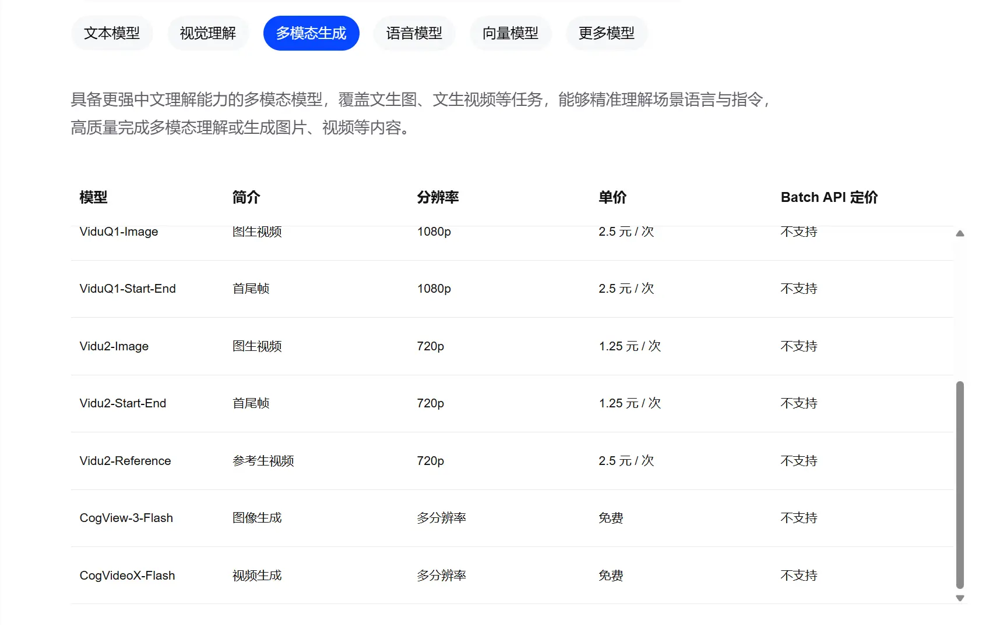
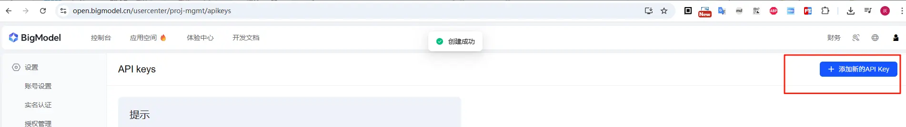
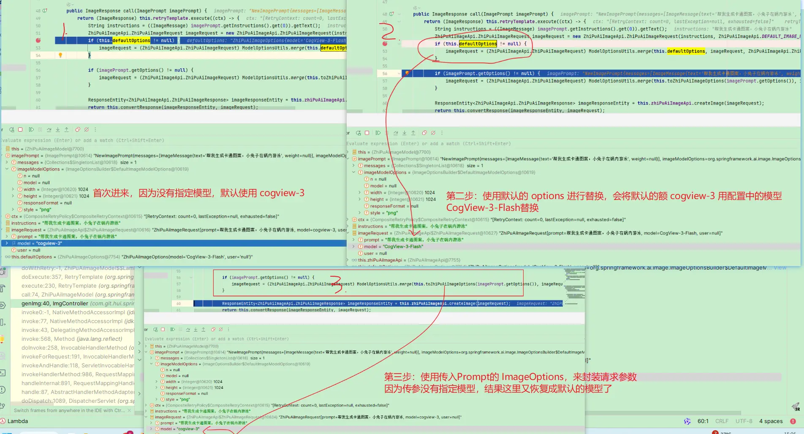
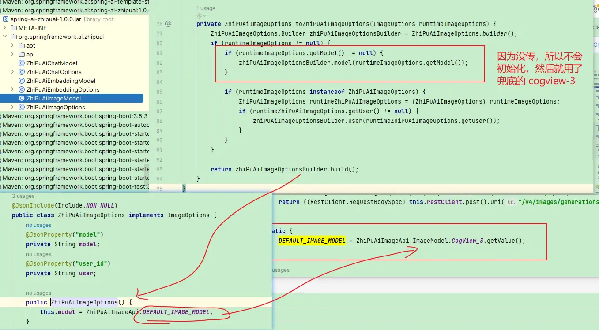
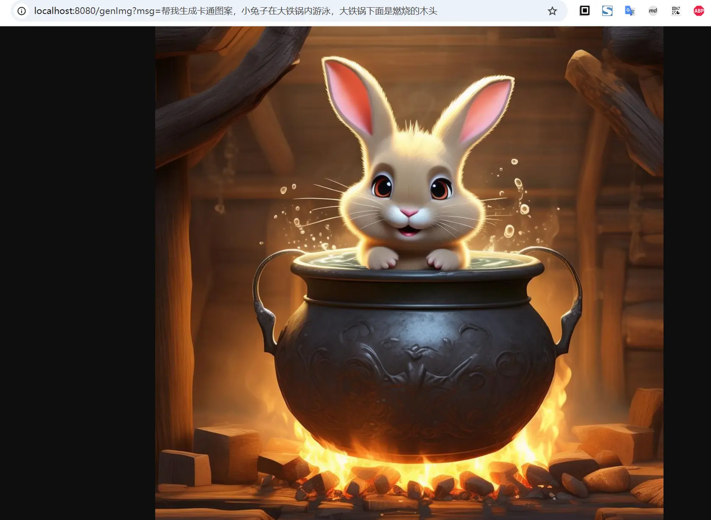

# 11.图像模型

截止到目前为止，我们所有的体验的还仅限于聊天模型，一问一答，且都是基于文本的交互方式；现在主流的模型的应用场景，涉及图像识别、图像生成、图像检索、图像处理等等，SpringAI也提供了相应的模型接口，方便开发者进行图像模型应用的开发

接下来我们通过一个实例，来看一下在SpringAI中，如何接入图像模型

## 一、准备工作

首先还是得准备一个大模型的开发者账号，同样的为了简化大家的使用成本，我们依然采用免费的大模型 - [智谱](https://www.bigmodel.cn/pricing) 来完成

### 1. 模型选择

智谱官方提供了两个免费的多模态模型，分别为

- CogView-3-Flash: 生成图片
- CogVideoX-Flash: 生成视频



### 2. 创建密钥

在智普的开放平台获取密钥：[https://open.bigmodel.cn/usercenter/proj-mgmt/apikeys](https://open.bigmodel.cn/usercenter/proj-mgmt/apikeys)



然后在配置文件中，添加智普的密钥


### 3. 配置密钥

在配置文件 `application.yml` 中，指定密钥和默认的模型

```yaml
spring:
  ai:
    zhipuai:
      # api-key 使用你自己申请的进行替换；如果为了安全考虑，可以通过启动参数进行设置
      api-key: ${zhipuai-api-key}
      image: # 图像模型
        options:
          model: CogView-3-Flash
      chat: # 聊天模型
        options:
          model: GLM-4.7-Flash
```

注意上面的 model，这里使用是图像生成的模型，与前面介绍的聊天模型中的 `GLM-4.7-Flash` 不一致

## 二、图像模型使用

接下来我们正式进入图像模型的使用环节，具体的项目创建过程，与之前的并无差别，基本流程同 [创建一个SpringAI-Demo工程](01.创建一个SpringAI-Demo工程.md)

### 1. 依赖配置

```xml
<dependencies>
    <dependency>
        <groupId>org.springframework.boot</groupId>
        <artifactId>spring-boot-starter-web</artifactId>
    </dependency>
    <dependency>
        <groupId>org.springframework.ai</groupId>
        <artifactId>spring-ai-starter-mcp-server-webmvc</artifactId>
    </dependency>
</dependencies>
```

### 2. 创建一个控制器

我们创建一个文生图的控制器，定义一个基于智谱图像模型的端点 `/genImg`， 生成之后，将返回的图片链接下载图片文件，直接返回给前端

```java
@RestController
public class ImgController {
    private final ImageModel imgModel;

    public ImgController(ZhiPuAiImageModel imgModel) {
        this.imgModel = imgModel;
    }

    /**
     * 生成图片并返回
     *
     * @param msg 提示词
     * @param res 返回图片
     * @throws IOException
     */
    @GetMapping(path = "/genImg", produces = "application/octet-stream")
    public void genImg(String msg, HttpServletResponse res) throws IOException {
        ImageResponse response = imgModel.call(new ImagePrompt(msg,
                ImageOptionsBuilder.builder()
                        .height(1024)
                        .width(1024)
                        .model("CogView-3-Flash")
                        // 返回图片类型
                        .responseFormat("png")
                        // 图像风格，如 vivid 生动风格， natural 自然风格
                        .style("natural")
                        .build())
        );
        Image img = response.getResult().getOutput();
        BufferedImage image = ImageIO.read(new URL(img.getUrl()));
        res.setContentType("image/png");
        ImageIO.write(image, "png", res.getOutputStream());
    }
}
```

说明：

- 具体的使用方式，直接基于 `ImageModel` 的调用来实现图片生成
- 实测： `ImageOptions` 中 `model` 参数，比填，不然不会使用配置中默认指定的 `CogView-3-Flash`

官方实现这里存在bug，由于传参没指定model，被sdk中默认的`cogview-3`给覆盖了（而不是默认选项中的 `CogView-3-Flash`）





### 3. 测试验证

接下来我们启动项目，验证一下图像模型的实际表现




题外话：生成的卡通图片还差强人意，如果换成写实风，这个模型的表现效果就很不理想了😂 （不过毕竟是免费的，还能要求啥呢~）

请重点注意： 智谱的 `ImageModel` 的实现是不支持生成视频的，最直接的证据就是 `ZhiPuAiImageApi` 的实现中访问的path路径是 `/v4/images/generations`，而视频的访问路径应该是 `/v4/videos/generations`，且交互方式也不一致（视频是异步查询返回结果）;

目前`1.0.0`版本以及`1.1.0-SNAPSHOT`的`spring-ai-zhipuai`客户端，没有实现视频模型的访问；如有需要，需自己实现

## 三、小结

本文主要介绍了图像模型的使用，虽然是以智谱为例进行的实例介绍；其他的模型使用姿势，实际也差不多，通用的使用方式如下

```java
ImagePrompt prompt = new ImagePrompt("这里是文生图的提示词", ImageOptionsBuilder.builder()
        .height(1024)
        .width(1024)
        .model("CogView-3-Flash")
        .build());
ImageResponse response = imgModel.call(prompt);
```


文中所有涉及到的代码，可以到项目中获取 [https://github.com/liuyueyi/spring-ai-demo](https://github.com/liuyueyi/spring-ai-demo/tree/master/S11-image-model)

