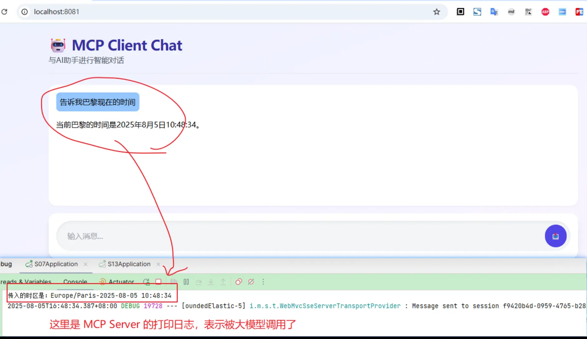
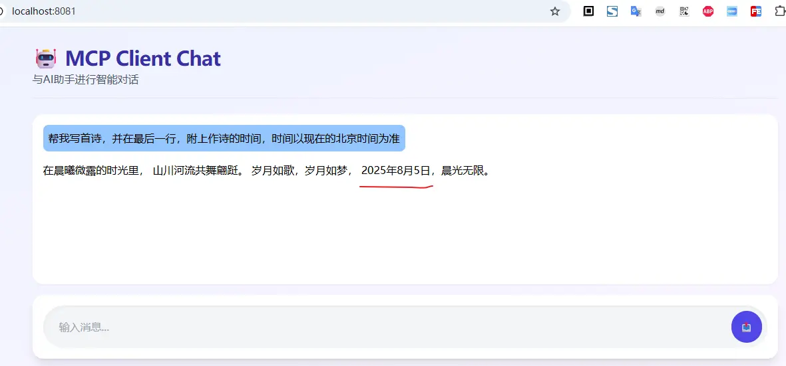
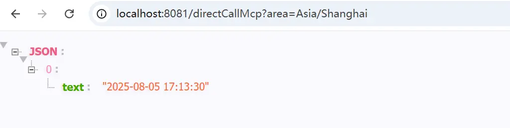

# 13.支持MCP Client的AI对话实现

前面介绍了通过SpringAI来实现MCP Server，接下来我们再看一下，通过SpringAI来实现一个支持上次实现的`MCP Client`的`AI`对话

## 一、项目初始化

SpringAI MCP客户端的starter，提供了MCP客户端的自动配置，支持多种传输方式（本地+网络），支持同步、异步的调用

### 1. 项目创建

创建一个SpringBoot项目，并引入SpringAI依赖，基本流程如 [创建一个SpringAI-Demo工程](01.创建一个SpringAI-Demo工程.md)

```xml
<dependencies>
    <dependency>
        <groupId>org.springframework.boot</groupId>
        <artifactId>spring-boot-starter-web</artifactId>
    </dependency>
    <dependency>
        <groupId>org.springframework.ai</groupId>
        <artifactId>spring-ai-starter-model-zhipuai</artifactId>
    </dependency>
    <dependency>
        <groupId>org.springframework.ai</groupId>
        <artifactId>spring-ai-starter-mcp-client</artifactId>
    </dependency>
    <dependency>
        <groupId>org.springframework.boot</groupId>
        <artifactId>spring-boot-starter-thymeleaf</artifactId>
    </dependency>
    <dependency>
        <groupId>io.github.wimdeblauwe</groupId>
        <artifactId>htmx-spring-boot-thymeleaf</artifactId>
        <version>3.4.0</version>
    </dependency>
</dependencies>
```

其中`spring-ai-starter-mcp-client`依赖，提供了MCP客户端的starter，使用的是智谱的免费大模型`GLM-4.7-Flash`

其次我们使用 `thymeleaf + htmx` 来实现一个简单的聊天界面

### 2. 项目配置

在配置文件中，除了指定大模型的密钥、模型之外，还需要配置MCP客户端的参数

```yaml
spring:
  ai:
    zhipuai:
      # api-key 使用你自己申请的进行替换；如果为了安全考虑，可以通过启动参数进行设置
      api-key: ${zhipuai-api-key}
      chat: # 聊天模型
        options:
          model: GLM-4.7-Flash
    mcp:
      client:
        sse:
          connections:
            global-date-times:
              # 这里使用 S07-mcp-server 创建的mcp服务，用于获取当前时间
              url: http://localhost:8080/sse
        enabled: true
        name: time-mcp
        version: 1.0.0
        request-timeout: 30s
        type: async


# 修改日志级别
logging:
  level:
    org.springframework.ai.chat.client.advisor.SimpleLoggerAdvisor: debug
server:
  port: 8081
```

我们这里的使用的`MCP Server`为[S07-mcp-server](https://github.com/liuyueyi/spring-ai-demo/tree/master/S07-mcp-server)中实现的根据地区获取当前时间的服务

## 二、MCP Client实现

SpringAI 对MCP Client 的实现封装的非常好了，对于上层应用而言，直接可以通过自定注入的 `ToolCallbackProvider`，将mcp client作为大模型的工具调用添加到模型中，然后通过模型调用，即可完成MCP的使用演示

### 1. 初始化ChatClient

直接通过模型和`ToolCallbackProvider``，来创建支持mcp调用的 `ChatClient`

```java
@Controller
public class ChatController {
    private final ChatClient chatClient;

    public ChatController(ChatModel chatModel, ToolCallbackProvider toolCallbackProvider) {
        System.out.println("当前注册的工具数量: " + toolCallbackProvider.getToolCallbacks().length);
        this.chatClient = ChatClient.builder(chatModel)
                // 将mcp client 作为大模型的工具来使用
                .defaultToolCallbacks(toolCallbackProvider)
                .defaultAdvisors(MessageChatMemoryAdvisor.builder(MessageWindowChatMemory.builder().build()).build(),
                        new SimpleLoggerAdvisor())
                .build();
    }
}
```

### 2. 实现聊天对话

聊天对话的实现，非常简单，通过 `ChatClient` 调用模型，并返回结果

```java
@Controller
public class ChatController {

    /**
     * 首页
     *
     * @param model
     * @return
     */
    @GetMapping("/")
    public String index(Model model) {
        return "index";
    }

    /**
     * 用户问答
     *
     * @param message
     * @param model
     * @return
     */
    @PostMapping("/ask")
    public HtmxResponse chat(String message, Model model) {
        String res = this.chatClient.prompt(message).call().content();
        model.addAttribute("question", message);
        model.addAttribute("response", res);
        // 返回 chat.html 中 chatFragment 经过渲染后的内容，用于对话的填充
        return HtmxResponse.builder().view("chat :: chatFragment").build();
    }
}
```

### 3. 前端聊天页面实现

聊天主页 index.html

```html
<!-- Thymeleaf -->
<!DOCTYPE html>
<html xmlns:th="http://www.thymeleaf.org">
<head>
    <title>支持MCP Client的聊天对话框</title>
    <script src="https://unpkg.com/htmx.org@1.9.12"
            integrity="sha384-ujb1lZYygJmzgSwoxRggbCHcjc0rB2XoQrxeTUQyRjrOnlCoYta87iKBWq3EsdM2"
            crossorigin="anonymous"></script>
    <script src="https://cdn.tailwindcss.com"></script>
    <script>
        function scrollToBottom(element) {
            document.getElementById('message').value = ''
            element.scrollTop = element.scrollHeight;
        }
    </script>
</head>
<body class="h-screen bg-gradient-to-br from-indigo-50 to-purple-50">
<div class="flex h-full max-w-6xl mx-auto">

    <main class="flex flex-col p-4 w-full">
        <header class="mb-6 py-4 border-b border-gray-200">
            <h1 class="text-3xl font-bold leading-none tracking-tight text-indigo-800">
                🤖 MCP Client Chat
            </h1>
            <p class="text-gray-600 mt-1">与AI助手进行智能对话</p>
        </header>

        <div id="chat" class="flex-1 mb-4 p-4 rounded-2xl bg-white shadow-sm overflow-auto">
            <!-- 消息将在这里显示 -->
        </div>

        <div class="bg-white rounded-2xl shadow-lg p-4">
            <form
                    class="w-full"
                    hx-post="/ask"
                    hx-swap="beforeend"
                    hx-target="#chat"
                    hx-indicator="#loading-indicator"
                    hx-on="htmx:beforeRequest:
                    document.getElementById('message').disabled = true;
                    document.getElementById('submit-btn').disabled = true;
                    document.getElementById('submit-btn').classList.add('opacity-50', 'cursor-not-allowed');
                    htmx:afterRequest:
                    document.getElementById('message').value = '';
                    document.getElementById('message').disabled = false;
                    document.getElementById('submit-btn').disabled = false;
                    document.getElementById('submit-btn').classList.remove('opacity-50', 'cursor-not-allowed');
                    scrollToBottom(document.getElementById('chat'));">
                <div class="flex items-center rounded-full bg-gray-100 p-2 shadow-inner">
                    <input type="text" name="message" id="message"
                           class="bg-transparent outline-none text-gray-700 rounded-full py-3 px-4 w-full"
                           placeholder="输入消息..."/>
                    <button type="submit" class="bg-indigo-600 hover:bg-indigo-700 text-white font-bold rounded-full p-3 ml-2 transition duration-200 relative">📤
                        <span id="loading-indicator" class="htmx-indicator absolute inset-0 flex items-center justify-center"><span class="animate-spin rounded-full h-6 w-6 border-b-2 border-white"></span></span>
                    </button>
                </div>
            </form>
        </div>
    </main>
</div>
<style>
    @keyframes spin {
        0% {
            transform: rotate(0deg);
        }
        100% {
            transform: rotate(360deg);
        }
    }

    .animate-spin {
        animation: spin 1s linear infinite;
    }

    .htmx-indicator {
        display: none;
    }

    .htmx-request .htmx-indicator {
        display: flex;
    }

    .htmx-request.htmx-indicator {
        display: flex;
    }
</style>
</body>
</html>
```

对话历史 `chat.html`

```html
<!DOCTYPE html>
<html xmlns:th="http://www.thymeleaf.org">
<body>
<div th:fragment="chatFragment" class="mb-8">
    <div class="inline-block bg-blue-300 rounded-lg p-2 ml-auto" th:text="${question}">Message</div>
    <p class="mt-4 h-full overflow-auto" th:text="${response}">Response</p>
</div>
</body>
</html>
```

### 4. 使用测试

首先，启动mcp server， 然后再启动聊天对话框；然后开始对话






## 三、小结

本文主要介绍将MCP Client的使用，整体应用起来，比较简单，甚至是比function calling更简单（因为自动将mcp服务注入为`ToolCallbackProvider`，可以直接传入`ChatClient`用作大模型的工具调用）

当然除了上面这种方式之外，我们也可以直接使用MCP Client来进行交互

> MCPClient 使用姿势参考官方文档： [java-mcp-client](https://modelcontextprotocol.io/sdk/java/mcp-client)

```java
// 自动获取McpClient (注意区分同步、异步）

@Autowired
private List<McpSyncClient> mcpSyncClients;  // For sync client


@Autowired
private List<McpAsyncClient> mcpAsyncClients;  // For async client


/**
 * 直接调用mcp服务
 *
 * @param area
 * @return
 */
@GetMapping("/directCallMcp")
@ResponseBody
public Object directCallMcp(String area) {
    Mono<McpSchema.CallToolResult> result = mcpClients.get(0).callTool(
    new McpSchema.CallToolRequest("getTimeByZoneId", Map.of("area", area))
    );
    return result.block().content();
}
```



文中所有涉及到的代码，可以到项目中获取 [https://github.com/liuyueyi/spring-ai-demo](https://github.com/liuyueyi/spring-ai-demo/tree/master/S13-mcp-client-chat)
